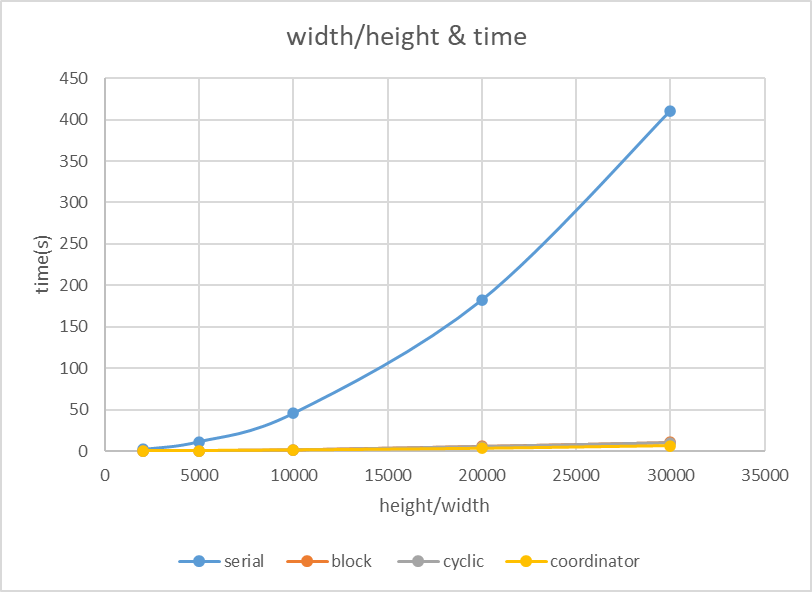
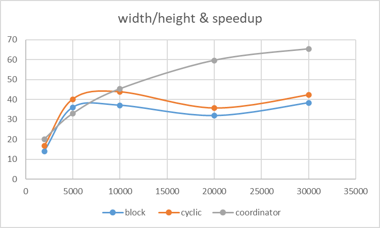
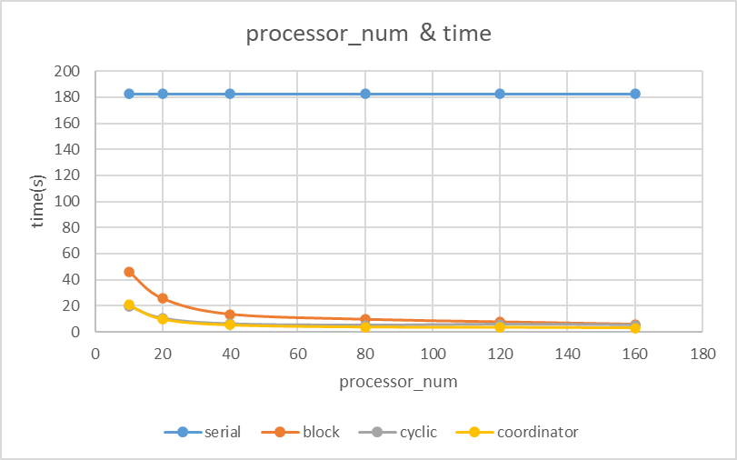
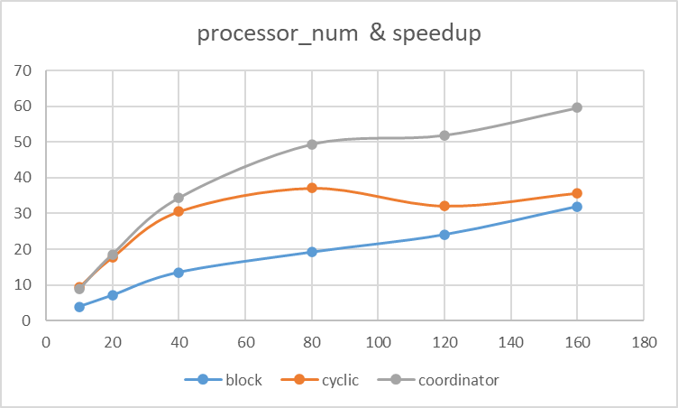

# Homework2

## Analysis

Q1: Which do you think is better? (Intern Block or Intern Cyclic?) Why? Which intern do you offer a full-time job? 

I think Intern Cyclic is better. Because of using cyclic distribution, the workload assigned to each processor is more evenly distributed. If using block distribution, some blocks in the image may require a lot of computation while others require much less, resulting in some processors having much longer running time and reducing the overall efficiency of the algorithm.

Q2: Analyze the speedup and efficiency of the two approaches against provided serial version. 

As shown in the experimental data in the appendix, I recorded the time for different processors and algorithms under the same width and height, and calculated their speedup using serial algorithm as the baseline. It can be seen that as the number of processors increases, the speedup of the three algorithms increases. As the width and height increase, the speedup of the three algorithms also increases. I think this is because as the computation increases, the proportion of communication overhead decreases, so the parallel effect becomes more significant. Among them, the coordinator/worker algorithm has the highest efficiency.

Q3: Compare the coordinator/worker strategy with Cyclic/Block’s implementation. Which do you think will scale to very large image sizes? Why? 

I believe that the coordinator/worker algorithm will scale well to very large image sizes. This is because the coordinator/worker pattern can better balance the workload of each processor. Moreover, in the case of large image sizes, communication time becomes less important and load balancing becomes more important. Compared to cyclic and serial algorithms, coordinator/worker can maximize the workload balance of each processor. From the experimental data, it can also be seen that coordinator/worker performs better for large image sizes.

## Experimental data

**size = 160**

**time: **

| n     | serial  | block    | cyclic   | coordinator |
| ----- | ------- | -------- | -------- | ----------- |
| 2000  | 1.827   | 0.129621 | 0.109066 | 0.090443    |
| 5000  | 11.409  | 0.316418 | 0.283988 | 0.346204    |
| 10000 | 45.616  | 1.227557 | 1.039772 | 1.006156    |
| 20000 | 182.402 | 5.712387 | 5.099455 | 3.05863     |
| 30000 | 410.603 | 10.69449 | 9.701577 | 6.279263    |

 

**speedup**

| n     | serial | block    | cyclic   | coordinator |
| ----- | ------ | -------- | -------- | ----------- |
| 2000  | 1      | 14.09494 | 16.75132 | 20.200568   |
| 5000  | 1      | 36.05674 | 40.17423 | 32.954559   |
| 10000 | 1      | 37.15999 | 43.87116 | 45.336906   |
| 20000 | 1      | 31.93096 | 35.76892 | 59.635196   |
| 30000 | 1      | 38.39387 | 42.32333 | 65.390317   |

 

**width=height=20000**

**time**

| size | serial  | block    | cyclic   | coordinator |
| ---- | ------- | -------- | -------- | ----------- |
| 10   | 182.402 | 46.32251 | 19.67729 | 20.783252   |
| 20   | 182.402 | 25.60703 | 10.34035 | 9.820045    |
| 40   | 182.402 | 13.48371 | 5.970255 | 5.304041    |
| 80   | 182.402 | 9.513813 | 4.908937 | 3.69        |
| 120  | 182.402 | 7.575961 | 5.672071 | 3.510274    |
| 160  | 182.402 | 5.712387 | 5.099455 | 3.05863     |

 

**speedup**

| size | serial | block    | cyclic   | coordinator |
| ---- | ------ | -------- | -------- | ----------- |
| 10   | 1      | 3.937654 | 9.269673 | 8.7763936   |
| 20   | 1      | 7.123121 | 17.63984 | 18.574457   |
| 40   | 1      | 13.52759 | 30.55179 | 34.389252   |
| 80   | 1      | 19.17233 | 37.15713 | 49.431436   |
| 120  | 1      | 24.07642 | 32.15792 | 51.962325   |
| 160  | 1      | 31.93096 | 35.76892 | 59.635196   |

 